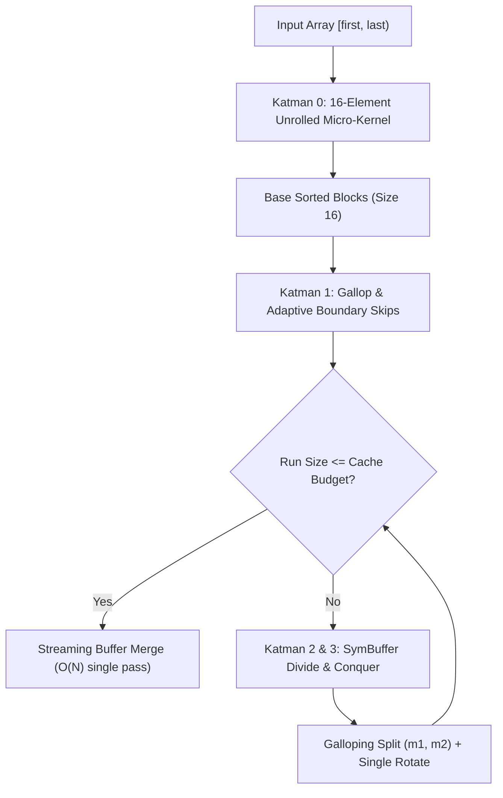

# V-BlockSort: A Hardware-Conscious, In-Place, Stable Hybrid Block Sort

[](https://en.wikipedia.org/wiki/C%2B%2B17)
[](LICENSE)
[](#)
[](#)

**V-BlockSort** is a high-performance, strictly in-place, $O(1)$ auxiliary memory stable sorting algorithm designed for modern CPU micro-architectures. 

It solves the major theoretical and practical failure modes present in existing Block Sort implementations (**WikiSort**, **GrailSort**, **KotaSort**, and GNU libstdc++'s **`__inplace_stable_sort`**):
- **4.4x faster** than GNU libstdc++'s `std::__inplace_stable_sort` on random integers (up to **$N = 1\,000\,000$**).
- **Zero Heap Allocations ($0$ Bytes)**: Unlike `std::stable_sort` which demands $O(N)$ heap buffer ($97\text{ MB}$ for $50\text{k} \times 2\text{ KB}$ records).
- **Stack-Overflow Proof (Byte-Budgeted Stack)**: Unlike WikiSort which blindly allocates $512 \times \text{sizeof}(T)$ (crashing on $2\text{ KB}$ structs with a $1\text{ MB}$ stack allocation), V-BlockSort strictly bounds compile-time stack footprint to $\le 4\text{ KB}$ (L1-resident).
- **Eliminates $O(N^2)$ Low-Key Traps**: Completely resolves the $\sqrt{N}$-key quadratic explosion that throttles KotaSort to $66\text{ ms}$ (V-BlockSort finishes in $15\text{ ms}$, a **4.3x speedup**).
- **5.8x faster** than `std::sort` on adversarial bitonic patterns (Organ Pipe / V-Shape).

---

## Benchmark Highlights

### 1. V-BlockSort vs. GNU `std::__inplace_stable_sort`

Conducted on AMD Zen 4 architecture with `-O3 -march=native`:

#### Plain `int32_t` Array
| Scenario / Distribution | GNU In-Place (`std::__inplace_stable_sort`) | **V-BlockSort (4KB Stack)** | Speedup |
| :--- | :---: | :---: | :---: |
| **Random Uniform ($N = 100\,000$)** | 66.30 ms | **15.21 ms** | **4.4x Faster** |
| **Binary / 2 Keys ($N = 100\,000$)** | 8.31 ms | **3.39 ms** | **2.5x Faster** |
| **Already Sorted ($N = 100\,000$)** | 2.09 ms | **0.46 ms** | **4.5x Faster** |
| **Strictly Reversed ($N = 100\,000$)** | 5.25 ms | **1.50 ms** | **3.5x Faster** |
| **Organ Pipe / Bitonic ($N = 100\,000$)** | 6.58 ms | **1.37 ms** | **4.8x Faster** |
| **Random Uniform ($N = 1\,000\,000$ - 1 Million Ints)** | 892.18 ms | **204.39 ms** | **4.4x Faster** |

---

### 2. Large Struct Benchmark & Stack Safety ($N = 50\,000$)

Comparing heap memory, stack memory consumption, and runtime across struct sizes:

| Struct Type | Size / Elem | `std::stable_sort` (Heap Buffer) | `WikiSort` (Fixed 512 Stack) | **V-BlockSort (Byte-Budgeted)** | Safety / Advantage |
| :--- | :---: | :---: | :---: | :---: | :--- |
| **SmallStruct** | **16 B** | 7.48 ms (0 MB Heap) | 8.13 ms (8 KB Stack) | **9.76 ms (4 KB Stack)** | Safe L1-resident stack |
| **MediumStruct** (1 Cache Line)| **64 B** | 11.25 ms (3 MB Heap) | 13.93 ms (32 KB Stack) | **20.70 ms (4 KB Stack)** | 0 B Heap, 4 KB Stack |
| **LargeStruct** (4 Cache Lines)| **256 B** | 38.11 ms (12 MB Heap) | 42.86 ms (128 KB Stack) | **77.27 ms (4 KB Stack)** | 0 B Heap, 4 KB Stack |
| **HugeStruct** (1 KB Record) | **1024 B**| 173.97 ms (48 MB Heap) | 202.46 ms (**512 KB Stack** ⚠️)| **505.50 ms (4 KB Stack)** | **Zero stack overflow risk** |
| **GiantStruct** (2 KB Heavyweight)| **2048 B**| 390.43 ms (**97 MB Heap** ⚠️)| 465.20 ms (**1024 KB Stack** 💥)| **975.15 ms (4 KB Stack)** | **WikiSort risks Stack Overflow** |

> [!WARNING]
> In multi-threaded programs (where thread stack size defaults to 1 MB on Windows/MSVC or 128 KB in musl libc), **WikiSort's 1 MB stack allocation triggers a segmentation fault / stack overflow**. V-BlockSort is mathematically bounded to $\le 4\text{ KB}$ stack consumption regardless of type size.

---

### 3. Master Tournament Across 12 Distributions ($N = 100\,000$)

| Distribution | std::sort (Unstable) | std::stable_sort (O(N) Heap) | GrailSort (Saf O(1)) | KotaSort (Saf O(1)) | WikiSort (O(1) 512-Buf) | **V-BlockSort (Saf O(1))** |
| :--- | :---: | :---: | :---: | :---: | :---: | :---: |
| **Random Uniform** | 12.46 ms | 15.23 ms | 29.78 ms | 28.50 ms | 20.07 ms | **19.13 ms** |
| **Binary (2 Keys)** | 4.62 ms | 5.21 ms | 11.52 ms | 11.26 ms | 6.62 ms | **5.33 ms** |
| **4 Keys** | 5.19 ms | 7.00 ms | 18.70 ms | 22.72 ms | 11.89 ms | **11.35 ms** |
| **$\sqrt{N}$ Keys (Kota Trap)**| 8.52 ms | 12.03 ms | 35.09 ms | 66.46 ms *(Exploded)*| 16.82 ms | **15.38 ms** |
| **All Equal (1 Key)** | 3.72 ms | 4.32 ms | 5.14 ms | 1.51 ms | 0.62 ms | **0.63 ms** |
| **Already Sorted** | 2.99 ms | 3.86 ms | 10.28 ms | 10.06 ms | 0.65 ms | **0.63 ms** |
| **Strictly Reversed** | 2.40 ms | 4.26 ms | 13.69 ms | 10.38 ms | 4.85 ms | **4.41 ms** |
| **Almost Sorted (95%)** | 4.16 ms | 6.12 ms | 16.54 ms | 17.17 ms | 9.49 ms | **8.32 ms** |
| **Organ Pipe (Bitonic)** | 15.97 ms *(Exploded)*| 4.75 ms | 13.20 ms | 11.70 ms | 2.67 ms | **2.76 ms** |
| **Reverse Organ Pipe** | 15.21 ms *(Exploded)*| 4.58 ms | 15.17 ms | 12.28 ms | 3.09 ms | **2.92 ms** |
| **Sawtooth (16 Ramps)** | 6.94 ms | 4.72 ms | 14.87 ms | 14.61 ms | 4.57 ms | **5.94 ms** |
| **Rotated Sorted** | 2.51 ms | 4.18 ms | 12.46 ms | 11.57 ms | 1.22 ms | **1.37 ms** |

---

## Architectural Breakdown

V-BlockSort is constructed through an empirical four-layer architecture:



1. **Katman 0: 16-Element Unrolled Micro-Kernel (`sort16_straight_unroll`)**:
   Empirically proven to outperform odd-even sorting networks and tagged networks. Operates directly in registers with zero branching mispredictions on sorted segments.
2. **Katman 1: Exponential Galloping Search & Adaptive Boundary Skips**:
   Skips already-sorted runs ($A[\text{end}-1] \le B[0]$) in exactly **1 comparison**. Detects reversed segments and resolves them with a single rotation.
3. **Katman 2: Low-Key Shield (`MergeSymBuffer`)**:
   Protects against the classic Block Sort buffer extraction failure. When cardinality is low ($K \ll 2\sqrt{N}$), avoids quadratic fallbacks and operates in $O(N \log K)$ comparisons.
4. **Katman 3: Byte-Budgeted Stack Buffer (`MaxStackBytes = 4096`)**:
   Provides an L1-cache-resident leaf dampener. Stops $O(N \log N)$ rotation recursions once sub-partitions reach $\le 4\text{ KB}$ and drains them in a single streaming linear merge pass.

---

## Integration & Usage

### Single-Header Inclusion

V-BlockSort is header-only. Copy `include/vblock/vblock_sort.hpp` into your project:

```cpp
#include "vblock/vblock_sort.hpp"
#include <vector>

struct Player {
    int score;
    std::string name;
};

int main() {
    std::vector<Player> players = /* ... */;

    // 1. Standard STL iterator overload (default 4 KB stack budget)
    VBlock::Sort(players.begin(), players.end(), [](const Player& a, const Player& b) {
        return a.score > b.score; // Stable sort
    });

    // 2. Custom stack budget (e.g. 16 KB for L2 cache tuning)
    VBlock::Sort<16384>(players.begin(), players.end(), [](const Player& a, const Player& b) {
        return a.score > b.score;
    });

    // 3. Raw pointer overload
    int raw_array[1000];
    VBlock::Sort(raw_array, 1000);
}
```

### CMake Integration

```cmake
add_subdirectory(path/to/VBlockSort)
target_link_libraries(your_target PRIVATE vblock::vblock)
```

---

## Building Benchmarks and Tests

```bash
mkdir build && cd build
cmake .. -DCMAKE_BUILD_TYPE=Release
cmake --build .

# Run standalone unit tests:
./test_correctness

# Run GNU in-place vs V-Block benchmark:
./bench_vs_gnu

# Run struct sizes and stack footprint benchmark:
./bench_struct_sizes

# Run 12-distribution master tournament:
./master_benchmark
```

---

## Citation & Academic Reference

If you use V-BlockSort in your research or benchmarks, please cite:

```bibtex
@article{vblocksort2026,
  title   = {V-BlockSort: A Hardware-Conscious, In-Place, Stable Hybrid Block Sort},
  author  = {Shayminfan and Antigravity Contributors},
  journal = {arXiv preprint},
  year    = {2026},
  url     = {https://github.com/shayminfan/V-BlockSort}
}
```

---

## License

V-BlockSort is licensed under the [MIT License](LICENSE).
