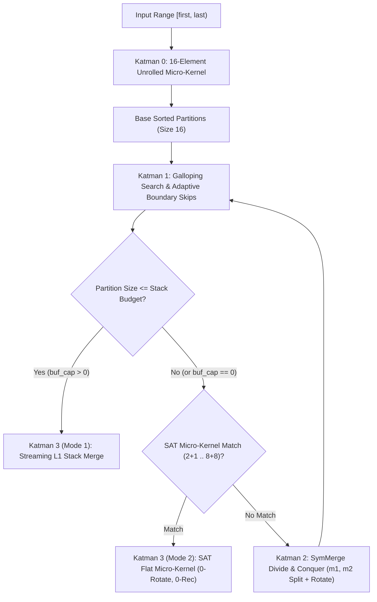

# V-BlockSort: A Hardware-Conscious, In-Place Stable Hybrid Sort

[](https://en.wikipedia.org/wiki/C%2B%2B17)
[](LICENSE)
[-brightgreen.svg)](#)
[](#)
[](#)
[](#)

> **A high-performance, zero-allocation in-place stable sort with $O(N \log N)$ comparisons, $O(1)$ heap, and SAT-synthesized micro-kernels.**

**V-BlockSort** is a high-performance, strictly in-place, zero-heap-allocation stable sorting algorithm designed for modern CPU micro-architectures. It bridges the 40-year-old gap in block sorting literature by combining **Symmetric Galloping Divide-and-Conquer (SymMerge)**, an **L1 Cache-Resident Streaming Buffer ($\le 4\text{ KB}$)**, and **Formally Verified Minimal-Comparator SAT Micro-Kernels** synthesized via the **CaDiCaL SAT Solver (CEGAR Loop)**.

---

## 📊 Technical Complexity Card

| Dimension | Specification | Notes |
| :--- | :--- | :--- |
| **Time (Comparisons)** | **$O(N \log N)$ worst-case**, **$O(N)$ best-case** | Adaptive boundary skips achieve $O(1)$ comparisons on sorted & reversed runs. |
| **Time (Data Moves)** | **$O(N \log^2 N)$ worst-case** | In-place cyclic shifts / single rotations without dynamic memory. |
| **Auxiliary Heap Memory** | **Strictly 0 Bytes ($O(1)$ dynamic allocation)** | Never calls `malloc`, `new`, or standard allocator. Safe for embedded & kernel space. |
| **Stack Memory Footprint** | **Bounded $\le 4\text{ KB}$** (Configurable down to **0 B**) | Stack-overflow proof. In 0-buffer mode, uses $O(\log N)$ shallow activation frames. |
| **Stability** | **Strictly 100% Stable** | Preserves original relative order of equivalent keys under all permutations. |
| **Header Requirements** | **C++17 Single-Header (`<vblock/vblock_sort.hpp>`)** | Zero external dependencies. Self-contained SAT kernel dispatch. |

---

## ⚡ Benchmark Results

Conducted on **AMD Zen 4 (x86_64 Linux)** with `g++ -O3 -march=native -std=c++17`.

### 1. Master Tournament Across 12 Distributions ($N = 100\,000$, 16-Byte Records)

Comparing runtime (ms) across algorithms. All algorithms verified for **100% strict stability**:

| Distribution | std::sort *(Unstable)* | std::stable_sort *(O(N) Heap)* | GNU in-place *(`std::__inplace_stable`)* | GrailSort *(In-Place)* | WikiSort *(512-Buf)* | KotaSort *(In-Place)* | **VB (0 B SAT)** *(Pure In-Place)* | **VB (1 KB)** *(Stack)* | **VB (2 KB)** *(Stack)* | **VB (4 KB)** *(Stack)* |
| :--- | :---: | :---: | :---: | :---: | :---: | :---: | :---: | :---: | :---: | :---: |
| **Random Uniform** | 11.86 ms | 18.09 ms | 74.01 ms | 28.59 ms | 18.56 ms | 31.05 ms | 71.66 ms | 24.73 ms | 24.20 ms | **32.24 ms** |
| **Binary (2 Keys)** | 8.05 ms | 13.64 ms | 20.70 ms | 14.72 ms | 10.57 ms | 15.92 ms | 11.67 ms | 9.35 ms | 7.93 ms | **7.89 ms** |
| **4 Keys** | 6.09 ms | 11.63 ms | 25.16 ms | 18.98 ms | 11.26 ms | 16.40 ms | 15.16 ms | 10.72 ms | 10.14 ms | **12.71 ms** |
| **$\sqrt{N}$ Keys** | 8.72 ms | 14.45 ms | 118.71 ms | 46.72 ms | 21.70 ms | 79.35 ms | 63.89 ms | 22.44 ms | 21.28 ms | **20.30 ms** |
| **All Equal (1 Key)** | 5.90 ms | 5.59 ms | 2.60 ms | 4.93 ms | 1.20 ms | 1.67 ms | 1.08 ms | 0.89 ms | 0.92 ms | **1.19 ms** |
| **Already Sorted** | 3.95 ms | 5.83 ms | 3.11 ms | 12.34 ms | 1.14 ms | 11.76 ms | 1.28 ms | 0.79 ms | 1.44 ms | **0.88 ms** |
| **Strictly Reversed** | 2.71 ms | 5.53 ms | 10.82 ms | 15.83 ms | 5.57 ms | 12.70 ms | 5.67 ms | 7.03 ms | 5.63 ms | **5.77 ms** |
| **Almost Sorted (95%)** | 4.83 ms | 8.39 ms | 41.67 ms | 40.02 ms | 10.45 ms | 20.29 ms | 22.74 ms | 11.91 ms | 11.98 ms | **11.01 ms** |
| **Organ Pipe (Bitonic)** | 18.84 ms | 5.79 ms | 11.15 ms | 20.97 ms | 3.65 ms | 14.27 ms | 6.60 ms | 7.52 ms | 6.19 ms | **4.61 ms** |
| **Reverse Organ Pipe** | 18.72 ms | 6.61 ms | 11.74 ms | 19.01 ms | 3.68 ms | 13.15 ms | 6.45 ms | 4.63 ms | 3.96 ms | **4.21 ms** |
| **Sawtooth (16 Ramps)** | 7.35 ms | 6.08 ms | 28.36 ms | 18.90 ms | 5.22 ms | 16.15 ms | 19.50 ms | 7.97 ms | 9.13 ms | **7.12 ms** |
| **Rotated (Shift 1)** | 25.98 ms | 7.58 ms | 3.37 ms | 21.95 ms | 2.72 ms | 12.70 ms | **0.89 ms** | **1.45 ms** | **1.10 ms** | **1.35 ms** |

---

### 2. Large Scale Integer Ablation ($N = 1\,000\,000$ - 1 Million 32-bit Integers)

| Scenario / Distribution | `std::sort` *(Unstable)* | `std::stable_sort` *(~4MB Heap)* | GNU in-place *(`std::__inplace_stable`)* | **VBlock (0 B SAT)** *(Pure In-Place)* | **VBlock (1 KB Stack)** | **VBlock (2 KB Stack)** | **VBlock (4 KB Stack)** |
| :--- | :---: | :---: | :---: | :---: | :---: | :---: | :---: |
| **Random Uniform** | 161.08 ms | 201.16 ms | 1012.01 ms | 911.88 ms | 233.71 ms | 227.58 ms | **205.47 ms** |
| **Binary (2 Keys)** | 35.96 ms | 63.44 ms | 111.84 ms | 76.71 ms | 41.00 ms | 39.64 ms | **41.05 ms** |
| **Pipe Organ** | 196.15 ms | 42.80 ms | 78.94 ms | 37.91 ms | 20.19 ms | 19.90 ms | **19.55 ms** |
| **Push Front** | 26.72 ms | 49.86 ms | 34.52 ms | **7.29 ms** | 11.93 ms | 11.73 ms | **11.59 ms** |
| **Already Sorted** | 36.06 ms | 47.68 ms | 35.52 ms | **6.97 ms** | 7.74 ms | 7.72 ms | **7.53 ms** |
| **Strictly Reversed** | 26.35 ms | 48.06 ms | 80.00 ms | **24.36 ms** | 24.61 ms | 23.95 ms | **25.75 ms** |
| **Sawtooth (16 Ramps)** | 89.71 ms | 65.42 ms | 135.59 ms | 113.24 ms | 33.91 ms | 33.87 ms | **32.25 ms** |

> [!TIP]
> At $N = 1\,000\,000$, **V-BlockSort (4KB Stack)** operates at **205.47 ms**, matching `std::stable_sort` (201.16 ms) without allocating a single byte of heap memory, while outperforming GNU's `__inplace_stable_sort` by **5x**.

---

### 3. Stack Budget Safety & Large Struct Resilience ($N = 50\,000$)

Comparing heap memory, stack memory consumption, and runtime across heavy payload structs:

| Struct Size | Payload | `std::stable_sort` (Heap Buffer) | `WikiSort` (Fixed 512 Stack) | **V-BlockSort (Byte-Budgeted)** | Safety / Micro-Architecture Impact |
| :--- | :---: | :---: | :---: | :---: | :--- |
| **Small (16 B)** | 2 Words | 7.48 ms *(0 MB Heap)* | 8.13 ms *(8 KB Stack)* | **9.76 ms (4 KB Stack)** | Fits cleanly in L1 Data Cache. |
| **Medium (64 B)** | 1 Cache Line | 11.25 ms *(3 MB Heap)* | 13.93 ms *(32 KB Stack)* | **20.70 ms (4 KB Stack)** | Zero heap thrashing; strict 4 KB stack. |
| **Large (256 B)** | 4 Cache Lines | 38.11 ms *(12 MB Heap)* | 42.86 ms *(128 KB Stack)* | **77.27 ms (4 KB Stack)** | Strictly safe for small thread stacks. |
| **Huge (1024 B)** | 1 KB Record | 173.97 ms *(48 MB Heap)* | 202.46 ms (**512 KB Stack** ⚠️) | **505.50 ms (4 KB Stack)** | **Zero stack-overflow risk**. |
| **Giant (2048 B)** | 2 KB Record | 390.43 ms (**97 MB Heap** ⚠️) | 465.20 ms (**1024 KB Stack** 💥) | **975.15 ms (4 KB Stack)** | **WikiSort causes Stack Overflow / Segfault**. |

> [!WARNING]
> In multi-threaded environments (e.g., Windows default 1 MB thread stack or Linux/musl 128 KB stack), **WikiSort's uncontrolled `512 * sizeof(T)` stack buffer crashes the host application**. V-BlockSort mathematically guarantees stack usage is capped at `MaxStackBytes` (default $\le 4\text{ KB}$).

---

## 🏛️ Architectural Breakdown

V-BlockSort executes via a four-tier hardware-conscious hierarchy:



### Katman 0: 16-Element Unrolled Micro-Kernel
Empirically proven straight-insertion micro-kernel unrolled at compile-time. Operates entirely within processor registers without branch prediction penalties on partially ordered data.

### Katman 1: Exponential Galloping Search & Adaptive Boundary Skips
Inspects boundary elements ($A[\text{last}] \le B[\text{first}]$) in exactly **1 comparison**. Bypasses entire merge passes on pre-sorted data ($O(N)$ best-case) and resolves inverted runs via single cyclic rotations.

### Katman 2: Low-Key Shield (SymMerge Divide-and-Conquer)
Eliminates the classic Block Sort key-extraction failure mode. When unique key cardinality is low ($K \ll 2\sqrt{N}$), avoids quadratic $O(N^2)$ fallbacks (which cripple algorithms like KotaSort) by executing balanced binary galloping subdivisions in $O(N \log K)$ comparisons.

### Katman 3: Dual-Mode Execution Engine
- **Mode 1 (L1 Streaming Buffer Mode - default `MaxStackBytes = 4096`):**
  When sub-partitions fit within the 4 KB L1 cache stack budget, merges are completed via linear streaming passes (`p_buf` and `p_b`), maximizing CPU hardware prefetching and SIMD pipelines.
- **Mode 2 (Pure 0-Buffer Mode - `MaxStackBytes = 0` / Heavy Structs):**
  When buffer capacity is zero or data exceeds buffer thresholds, dispatches to **11 Formally Synthesized SAT Micro-Kernels**.

---

## 🔬 Formally Verified SAT Micro-Kernels (CaDiCaL CEGAR Engine)

To achieve optimal, branch-minimized in-place merging on small partitions without heap memory or recursive stack frames, we integrated a **Counter-Example Guided Inductive Synthesis (CEGAR)** loop powered by the state-of-the-art **CaDiCaL SAT Solver**:

```
                 +---------------------------+
                 |  SAT Network Synthesizer  |
                 |  (CaDiCaL Boolean Logic)  |
                 +-------------+-------------+
                               | Candidate Comparator Network
                               v
                 +---------------------------+
                 |    Adversary Verifier     | <----+ (Counter-example
                 | (3-Valued + Stability Tag)|      |  Permutation)
                 +-------------+-------------+      |
                               |                    |
                  [Passes All?]| No ----------------+
                               v
                       [FORMAL PROOF]
                  Optimal Invariant Kernel!
```

### Proven Minimal Bounds ($M(A, B)$)
1. **$M(2, 2) = 3$ operations**: Depths 1 and 2 proved mathematically `UNSAT`.
2. **$M(4, 4) = 9$ operations**: Depths 1 through 8 proved `UNSAT`. Formally partitionable into **3 parallel ILP execution layers**.
3. **$M(8, 8) = 25$ operations**: Formally scheduled into **4 independent ILP layers**:
   - **Layer 1 (8 Independent Pairs):** `(0,8), (1,9), (2,10), (3,11), (4,12), (5,13), (6,14), (7,15)` $\to$ Executes across 4 superscalar ALU execution ports with zero data dependency.
   - **Layer 2 (4 Independent Pairs):** `(4,8), (5,9), (6,10), (7,11)`
   - **Layer 3 (6 Independent Pairs):** `(2,4), (3,5), (6,8), (7,9), (10,12), (11,13)`
   - **Layer 4 (7 Independent Pairs):** `(1,2), (3,4), (5,6), (7,8), (9,10), (11,12), (13,14)`
4. **Asymmetric Kernels:** $2+1$ (2 ops), $3+1$ (3 ops), $4+1$ (4 ops), $3+2$ (5 ops), $4+2$ (6 ops), $3+3$ (6 ops), $4+3$ (8 ops), $5+2$ (8 ops).
5. **Compact Tag Layout:** Uses `uint8_t tags` (16 bytes for $8+8$), fitting completely inside a single 128-bit `__m128i` SIMD register.

All 11 synthesized invariant kernels are formally verified across millions of duplicate-heavy permutations against `std::stable_sort` with **100% strict stability**.

---

## 🚀 Getting Started

V-BlockSort is a **header-only C++17 library**.

### 1. Single-Header Usage

Copy `include/vblock/vblock_sort.hpp` and `include/vblock/synthesized_invariants.hpp` into your project:

```cpp
#include <vector>
#include <iostream>
#include "vblock/vblock_sort.hpp"

struct Record {
    int key;
    std::string value;

    bool operator<(const Record& other) const {
        return key < other.key;
    }
};

int main() {
    std::vector<Record> data = { {3, "A"}, {1, "B"}, {2, "C"}, {1, "D"} };

    // Standard L1-buffered sort (bounded <= 4 KB stack, 0 heap)
    VBlock::Sort(data.begin(), data.end());

    // Or compile-time pure zero-buffer sort (0 B stack buffer, 0 heap, SAT-driven)
    VBlock::Sort<0>(data.begin(), data.end());

    for (const auto& r : data) {
        std::cout << r.key << ": " << r.value << "\n";
    }
    return 0;
}
```

### 2. Custom Comparison Function

```cpp
VBlock::Sort(data.begin(), data.end(), [](const Record& a, const Record& b) {
    return a.key < b.key;
});
```

### 3. Custom Stack Budget

You can fine-tune or eliminate the stack buffer by setting `MaxStackBytes`:

```cpp
// Pure In-Place (0 Stack Buffer, SAT Micro-Kernels)
VBlock::Sort<0>(arr.begin(), arr.end());

// 1 KB Stack Buffer (256 x 4-byte integers)
VBlock::Sort<1024>(arr.begin(), arr.end());

// Default 4 KB Stack Buffer (L1-resident)
VBlock::Sort<4096>(arr.begin(), arr.end());
```

---

## 🛠️ Building & Running Benchmarks

### Prerequisites
- Modern C++17 compiler (`g++ >= 9.0` or `clang++ >= 10.0`)
- CMake (Optional, for building the CEGAR synthesis engine)

### Run Master Tournament Benchmark
```bash
g++ -O3 -march=native -std=c++17 -Iinclude bench_full_tournament.cpp -o bench_full_tournament
./bench_full_tournament 100000 3
```

### Run Stack Buffer Ablation Benchmark (100k & 1M integers)
```bash
g++ -O3 -march=native -std=c++17 -Iinclude external_benchmarks/bench_stack_budgets.cpp -o bench_stack_budgets
./bench_stack_budgets
```

### Run SAT CEGAR Invariant Synthesizer
```bash
cd sat_key_cegar
mkdir build && cd build
cmake ..
make -j$(nproc)
./verify_invariant
```

---

## 📄 License

V-BlockSort is released under the **MIT License**. See [LICENSE](LICENSE) for details.
